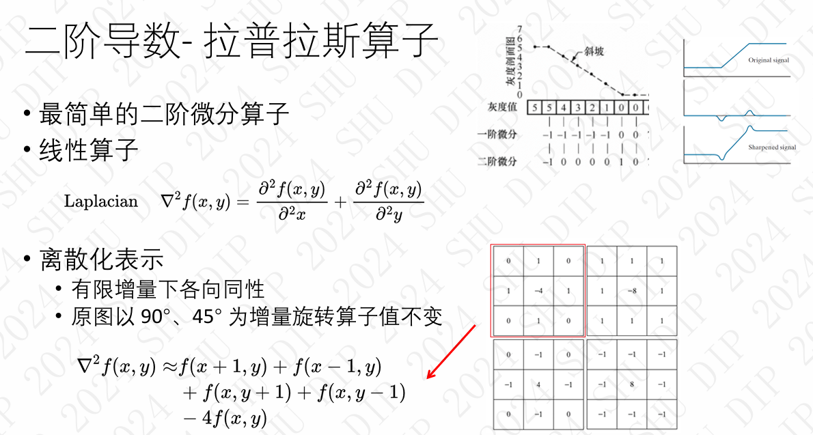
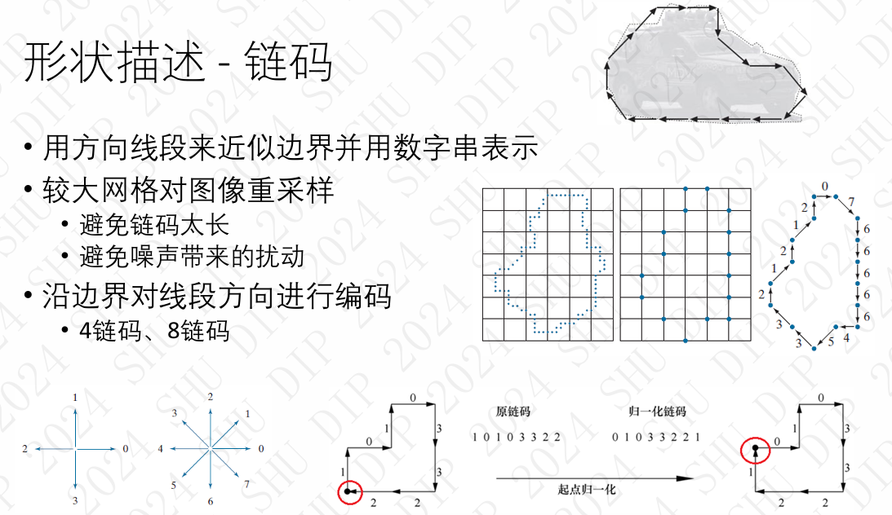

题型：填空 选择 判断 简答 综合（无编程，写一些流程->平时实验）
# 第一章

### 数字图像成像源分类

1. **电磁波成像**：是数字图像成像的主要来源，其中**可见光**是最关键的部分。
- 电磁波谱（按光子能量分组）涵盖了从低频无线电波到高频伽马射线的范围。不同波长的电磁波在不同领域有不同的应用。
    - **伽马射线**用于核医学成像/天文观察
    - **X射线**用于医学成像用于CT等技术。
    - **红外和可见光**：而红外成像可在环境较暗时进行，如夜视仪和遥感图像。
    - **微波成像** ：典型应用是雷达 ， 不受气候光照影响
    - **无线电成像** ： 磁共振成像(MRI) 天文学
2. **其他成像源**：包括声波、超声波和电子成像。
### 图像技术的三个层次

1. **低级图像处理**：对图像的预处理：去除噪声、对比度增强、图像锐化；输入输出都是图像
2. **中级图像处理**：图像分割（将图像分割成很多区域或物体） 提取分割后目标的特征 ；输入是图片，输出是特征（边缘、轮廓、直方图）
3. **高级图像处理**：对目标进行分类和识别，对场景中发生的事情进行理解

1 图像的单元是像素，图像可以看作二元矩阵 
2 数字图像是一个理想化的东西
3 数字图像成像源中最主要的是电磁波，其他包括声波超声波，电子
电磁波中最主要的是可见光
4 图像技术的三个层次：

# 第二章
- 人的视觉感知 
- 图像感知与获取 
- 图像取样和量化 
- 数字图像的表示 
- 图像的基本数学运算 
- 常见图像文件格式

## 2.3 图像取样和量化 
#### 2.3.1 图像的取样 Sampling 
• 将空间上连续的画面转换成离散的取样点 
• 取样在x和y方向进行 
• 图像的分辨率由CCD和取样过程决定 
• 每个取样点对应于图像中的一个单元，也称像素

取样尺寸对画质的影响 
• 面阵相机，CCD尺寸越大，取样率越高，分辨率越高

#### 2.3.2 图像的量化Quantization 
• CCD感应值的数字化称为量化 
• 量化的级数称为灰度级 
• 取值是2的整数幂
#### 2.3.3 量化级数对画质的影响 
• 灰度：从纯白、纯黑的过渡

## 2.4数字图像的表示
#### 2.4.1 灰度图像
 • 只有亮度，没有颜色 
 • 二维矩阵 • 值0~1.0或0~255 
 • 8 bit / pixel
#### 2.4.2 彩色图像
三通道二维矩阵 24 bit / pixel
分为RGB三个通道

## 2.5 图像的基本数学运算

#### 2.5.1 图像的算术与逻辑运算
• 算术：加、减、乘、除
• 逻辑：与、或、非
图像中算术/逻辑操作主要在两幅或多幅图像间进行
• 图像就是二维矩阵 
• 矩阵之间的运算

加运算：去噪、图像合成
减运算：蓝/绿屏技术、图像比较、运动目标提取
乘运算：选择图像区域
除运算：阴影消去
#### 2.5.2 图像的规范化 
• 图像在进行运算像素值可能小于零或大于255 
• 加运算：0 到 510 
• 减运算：-255 到 +255 
• 规范化是将其转换为0-255范围的过程 
• 规范化方法：直接截断法 、线性规范法
#### 2.5.3 图像的几何变换 
• 实际上像素坐标的空间变换
#### 2.5.4 变换后的像素重赋值 
• 图像几何变换后带来的问题 ：新位置像素的赋值
• 像素赋值（反向） 
• 由（x',y'）反变换找到(x,y) ，并赋值 
• 找到的是非整数坐标怎么办 
• 插值法interpolation 
    • 最近邻插值 ：简单效果就会差一点
    • 双线性插值 ：由4个近邻的像素值线性加权
    • 双三次插值
    • 图像超分辨率 ：基于学习的插值

## 2.6 常见图像文件格式
/

1 人眼是一个主观的东西
2 图像的生成，照射源照射到场景元素上反射/透射而成的
3 图像传感器，ccd捕捉数字图像取代胶片
4 图像的取样和量化：ccd拍照：==离散化的过程==，
矩阵越大，采集精度越高
CCD尺寸越大，取样率越高，分辨率越高
图像的量化：采集到的是彩色的->三个通道亮度值
图像的操作：加操作可以用来去噪
几何运算本质是坐标点的移动
图像变换后，需要进行插值：最近邻和双三次

# 第三章 灰度变化与空间滤波
• 图像增强概述 
• 灰度变换 
• 直方图技术 
• 空域滤波

## 3.1 图像增强概述 

图像增强的主要目的是处理一幅图像，使其结果对特定的应用而 言比原始图像更合用。
#### 3.1.1 空域增强方法
**空域 spatial domain** 
• 指图像的二维坐标平面 
• 直接对原始像素进行处理 
• 相对于变换域 ，如频域 frequency domain
**主要技术**：灰度变换 、 直方图方法 、 空域滤波
#### 3.1.2 灰度图像的数学表示
• 二维矩阵 
• f(x ,y ) 表示该位置的亮度值
• 取值通常为0 ~ 255 （深度为8） 
• 0表示纯黑，255表示纯白
#### 3.1.3 空域处理

## 3.2 灰度变换
#### 3.2.1 灰度变换

#### 3.2.2 图像反转
• 变换前后的灰度值分别为r和s 
• 灰度级范围是 [0, L-1]  
• 图像反转的公式s=L-1-r
• 用途 : 比如：增强大片黑色区域中的白色或灰色细节
#### 3.2.3 ==幂变换（伽马变换）==
- 变换公式 $s=cr^γ$
    r-原来值；s-输出值；c-常数；γ-指数
- 像素值事先需要归一化到[0,1]
- ==伽马值：小于1扩展低灰度范围 ，大于1扩展高灰度范围==

#### 3.2.3分段线性变换
分段线性函数 ，优点是可以任意复杂
• 可用于对比度拉伸 、提升灰度级的动态范围 
• 对比度低的形成原因 ：光照不足 、 光圈设置错误 、 CCD动态范围小
#### 3.2.4灰度变换的快速计算方法 
• 图像像素点多，计算量大 ：一幅尺寸800 x 600的图像， 48万次的变换计算
• 灰度图像的特点 ：像素值始终落在0 – 255的整数 
• 查找表LUT(Look-Up Table) 技术 
    • 针对变换公式$s=T(r)$，构造长度256的映射表 
    • 实际操作时，变换通过查表实现，而不用再计算

## 3.3 直方图技术
#### 3.3.1 直方图
##### 3.3.1.1 直方图概念
•图像中像素的亮度（灰度级）可以看作一个随机变量，其分布反映了图像的统计特性。
•灰度直方图是灰度级的统计函数，反映了图像中每个灰度级出现的频率。

##### 3.3.1.2 直方图归一化
频率到概率，除以总像素点个数

##### 3.1.1.3直方图反映的特点
对比度高的图像，直方图是接近均匀分布
#### 3.3.2==直方图均衡化==
• 根据输入图像的直方图自动增强对比度
• 直方图均衡化
    • Histogram equalization 
    • 根据输入图像的直方图自动找到一个变换函数 
    • 变换后的图像具有平坦的直方图
统计量分析

直方图均衡化使用的是==累计分布函数==（这个很重要）

例题：

离散变换一般不能产生完全均匀的pdf，但有展开输入直方图的趋势。
直方图均衡化能自动确定变换函数，产生有近似均匀直方图的输出图像
#### 3.3.3 局部直方图处理
• 用整幅图像的直方图设计变换函数 
• 不适合增强局部范围内的对比度
**局部直方图均衡化** 
    • 在每个像素位置 
        • 选择较小的邻域 
        • 统计邻域内的直方图 
        • 局部直方图均衡化 
        • 但只映射该像素位置 
    • 遍历整幅图像，重复操作 
    • 计算量很大

## 3.4 空域滤波
• 滤波器一词原本来自频域处理 
• 指处理图像的指定频率分量 
• 空间滤波通过直接对原始图像进行处理，达到类似效果 
• 空间滤波器的邻域通常定义为方形 
• 输出的每个像素的值是对应输入邻域内像素的函数值

#### 3.4.1 滤波器分类
• 线性滤波器 
    • 图像和滤波器核之间 
    • 乘积之和的运算 
    • 核的大小定义了邻域大小 
    • 系数确定了滤波器的性质 
    •核中心逐像素移动，生成滤波后图像 
•非线性滤波器
    • 非线性运算
#### 3.4.2 平滑滤波器
图像噪声：来源于采集与传输过程
    高斯噪声 ：照度低、CCD发热等 
    椒盐噪声： 传输问题、CCD和镜头污点、电磁干扰等
怎样去噪 ：
    时域平均 ：采集多幅图像后相加求平均 ， 对于加性白噪声尤其有效 
    只能捕捉一幅图像怎么办 ：
        时域平均= 空域平均（随机过程的可遍历性） 
        在像素的邻域内进行平均
平滑滤波器的其他作用：
- 过滤细节，提取主干
- 照片中的皮肤平滑
- 阴影消去：高斯核模糊原图得到阴影图
##### 3.4.2.1均值滤波器
- **输出掩模所覆盖邻域中的像素均值**
- 作用 ：
    • 去噪，用邻域均值来替换像素值，逼近真实值 
    • 可去除图像中不相干（尺寸小于掩模）的细节

• 均值滤波器 3 × 3, 11 × 11, 21 × 21 
• 掩模尺寸逐渐增大 ：图像更平滑，去噪能力加大
• 负面效应 •：导致边缘模糊 ；可遍历性在亮度一致区域才满足
##### 3.4.2.2 高斯滤波器
- **权值体现了远近像素点的不同影响** 
    离中心越近，权值越高 
- 通过二维高斯函数的整数间隔采样

高斯核更平滑
##### 3.4.2.3双边滤波器
让边缘仍然清晰
##### 3.4.2.4 中值平滑滤波器(==对椒盐噪声尤其有效==)
- 输出一个邻域的中值
- 是把$3*3$的窗口里的数按从小到大排列，会把很大的值噪声很小的值排除在两端，所以可以过滤椒盐噪声。
- 不是线性滤波器
- 模糊较少，保留边缘

#### 3.4.3锐化滤波器
- 突出图像中灰度变化部分 
- 可以增加图像的细节（边缘和轮廓）
- 也可能会引入噪声 
- 帮助提取目标的边界，用于图像分割、特征提取
==要很清晰的感觉，必然是边缘比较清晰==
图像边缘：图像中像素剧烈变化的位置； 包含了丰富的图像细节
滤波器思想：边缘检测（求导，边缘是图像像素剧烈变化的区域，所以找导数大的地方就是边缘强的地方，所以要做差分来近似求导），然后再把边缘加回去

使用**二阶导数- 拉普拉斯算子**
通过那个式子是怎么构造出滤波器的那个具体的卷积的那个核

该离散形式表明，当前位置的值 f(x,y)被周围四个邻域值所平衡。如果周围值与当前位置的差异较大，则该位置将有较高的拉普拉斯值，表示潜在的边缘。
一阶导是梯度算子（不用管）

## 小结
- 图像增强调节了图像的某些特性 
- 灰度变换取决于变换函数的特性 
- 直方图技术采用统计量分析来进行自动变换 
- 滤波器通常作用在方形局部邻域 
- 平滑滤波器能去除噪声，但模糊了图像 
- 锐化滤波器采用求导操作，对噪声敏感 
- 很多时候多种增强手段要一起作用

空域频域
伽马变换，幂变换：调整图像亮度
r-原来值；s-输出值；c-常数；γ-指数
直方图：对比度高的图像，直方图是接近均匀分布
用累计分布函数让直方图均衡化，==过程要知道==
算法步骤，一定要会
书上的例子好好看
空间滤波器：很重要
给你个模板怎样做成滤波：19：42从上到下去加权，看实验
均匀滤波器，中值滤波器==过程==
椒盐噪声：高斯滤波器、均匀滤波器、均值滤波器都不行了；只能用中值滤波器
中值滤波器（==过程==）：是把3*3的窗口里的数按从小到大排列，会把很大的值噪声很小的值排除在两端，所以可以过滤椒盐噪声
锐化滤波器：要很清晰的感觉，必然是边缘比较清晰
滤波器思想：边缘检测（求导，边缘是图像像素剧烈变化的区域，所以找导数大的地方就是边缘强的地方，所以要做差分来近似求导），然后再把边缘加回去
二阶导数-拉普拉斯算子：通过那个式子是怎么构造出滤波器的那个具体的卷积的那个核（查一下）
一阶导：梯度算子，

# 第四章 频率域滤波
- 图像的频域 
- 傅里叶变换 
- 图像的傅里叶变换  
- 频域滤波原理 
- 常用滤波器

#### 4.1 图像的频域 
低频成分 对应于 图像的主体特征
高频成分 对应于 图像中的细节
**为什么在频域中增强图像**：
- 人类视觉易于感受的是空间域 
- 有些在空域中不好处理的问题 
- 在频域中却很容易处理

**图像的变换域：**
将图像由空间域转换到变换域，使图像的某些特征突出，便于后面的处理。
常见变换方法：傅里叶变换
应用 ：
    图像增强：低通滤波，高通滤波 
    图像压缩：正交变换、DCT 
    提取图像特征：直流分量，目标物边缘

#### 4.3图像的傅里叶变换
图像傅里叶变换的理解：图像由不同频率的二维三角函数构成。
时域和频域都是离散的 ，计算机才能够处理

傅里叶反变换可以完全重建图像 ，所以JPEG压缩的核心 ， 保存的是傅里叶变换后的系数 ， 丢弃人眼不可查的高频系数可实现极大压缩

#### 4.4 频域滤波的原理

#### 4.5 常用滤波器
1. 低通滤波器：去掉高频分量，保留低频分量--->平滑图像
2. 高通滤波器：去掉低频分量，保留高频分量--->边缘提取
3. 选择性滤波器：带通、带阻、陷波

这章掌握概念，公式不用管
比如说某个频率对应的是某种噪声，就把这个频率的值置0就把噪声去掉

# 第五章 彩色图像处理
- 光与颜色 
- 原色与光度图 
- 常见颜色模型
- 彩色图像增强 
- 伪彩色图像增强
#### 5.3常见颜色模型
##### 5.3.1面向硬件的颜色模型---RGB模型
RGB用于显示、图像的存储与表示–彩色图像
加色模型：显示三原色：RGB
减色模型：用于印刷的模型– CMY模型
##### 5.3.2 面向感知的颜色模型---HSI模型
色调Hue：感受到的主波长纯色类别，是感知的主导色，如红色、绿色、黄色
饱和度Saturation：彩色的纯度，如浅红、深红 （色调、饱和度通称为色度）
亮度Intensity/Lightness/Value：颜色的明亮程度，如亮黄、暗黄 ，与光的强度，或颜料中的白、黑的量相关色调、饱和度通称为色度

#### 5.3彩色图像增强
彩色变换；互补色、对比色；亮度校正；颜色平衡；直方图均衡化；彩色图像平滑；彩色图像锐化
#### 5.4 伪彩色图像增强
根据特定的准则对灰度图像赋以假想的彩色
主要目的 ：便于观察和理解图像中的目标 ；人可辨别上千种颜色，但仅能辨别很少的灰度级。
伪彩色处理方法 ：灰度分层 ； 灰度-彩色变换

颜色是不同频率的光

# 第六章 图像压缩技术
- 图像压缩概述 
- 变长编码 
- 预测编码 
- 变换编码 
- 视频压缩 
- 图像压缩国际标准
#### 6.1 图像压缩概述
图像压缩是通过对原始采集的图像进行编码以减少数据量
压缩率= 原存储方法下的平均码长/编码后的平均码长 （通常大于1）
压缩类型：信息保存型、信息损失型
==图像压缩的可行性-->图像原始存储方式中存在的三种冗余：==
==（1）编码冗余：所选的符号系统效率不高（也即平均编码长度较长）==
==（2）像素相关冗余：像素之间是存在相关性的，无视这种相关性带来的数据的重复==
==（3）心里视觉冗余：人对有些视觉信息并不敏感，在不削弱图像的视觉感知的情况下可以去除，这通常是有损压缩==

熵
（1）香农第1定律：
==熵给定了无损描述一个信源所需平均码长的最小值==；
熵反映了信源的不确定性
（2）==熵决定了编码该图像所需的最小平均码长==
无损压缩的极限是熵，定义了无损压缩的码长下限
#### 6.2 ==变长编码（哈夫曼编码）==
频率高的码长短
哈夫曼编码是一种无损压缩算法，主要通过给不同频率的符号分配不同长度的编码来实现压缩。
生成的哈夫曼树是一棵带权路径长度最短的二叉树，较常出现的符号会分配较短的编码路径，不常出现的符号会分配较长的编码路径。

#### 6.3预测编码
==去除图像中的相关冗余==
用邻近像素来预测当前像素 ，对预测误差进行编码

#### 6.4 变换编码
过程：
    将图像经过变换（如变换到频域）得到系数 
    对系数进行量化（约简）后再编码
通常是有损的
是当前主流编码方式，JPEG采用此方法
核心思想：把人眼看不到的高频系数去掉，只保留低频系数
#### 6.5 视频压缩
 **空间冗余去除（空间压缩）**
- **思想**：图像内的像素值往往具有相似性，比如相邻像素颜色或亮度相近。空间压缩主要用于减少单帧图像内部的冗余信息。
 **时间冗余去除（时间压缩）**
- **思想**：视频是由一系列连续帧组成的，帧与帧之间通常有很强的相似性。例如，场景中的大部分像素在相邻帧之间变化很小。时间压缩利用这一特性，只编码帧间的变化部分。

相邻帧相关性较强，时域冗余信息很多 
时域预测比空域预测效率更高
#### 6.6 图像压缩国际标准
采用离散余弦变化DCT 作为核心的静止图像压缩国际标准是JPEG

压缩为了减少计算量

# 第七章 形态学图像处理
1. 腐蚀使图像中的物体区域缩小 
    • 去掉小于结构元素的物体(毛刺、小凸起) 
    • 不同大小的结构元，可以去掉不同大小的物体 
    • 如果两个物体之间有细小的连通，可以将两个物体分开 
2. 膨胀使图像中的物体区域扩大 
    • 可用来填补物体中的空洞，或桥接小的裂缝

开运算：先腐蚀，后膨胀
闭运算：先膨胀，后腐蚀
1. 开运算一般能 
    • 断开狭窄的间断 
    • 消除细的突出物，使物体的轮廓变得光滑 
2. 闭运算同样使轮廓线更为光滑，但与开操作相反的是，它通常 
    • 弥合狭窄的间断和长细的鸿沟 
    • 消除小的孔洞，填补轮廓线中的断裂 

优点 ：能保持物体的大致尺寸不变

# 第八章 图像分割
- 图像分割概述 
- 基于阈值的方法 
- 基于边缘的方法  
- 基于区域的方法
#### 8.1 图像分割的概念
将图像划分成不相交的子区域 ，区域内具有某种意义上的一致性（如颜色、亮度、纹理、语义....）
图像分割的作用：
- 简化或改变图像的表现形式
- 使得图像更容易理解和分析
- 在各个领域有应用广泛
图像分割算法：
- 和特定的应用、图像不同性质相关
- 利用了图像的两个基本特性：
    同一目标内具有相似性
    不同目标间的边界上，有不连续性
#### 8.2 ==基于阈值的方法==
适合不同对象(区域)在灰度值上 存在较大差异的情况  
• 通过设定灰度值阈值来分割 
    以图像直方图来指导 
    单阈值分割（二值化问题） 
    多阈值分割
==自动确定阈值的算法：==

这种方法对具有**双峰灰度直方图**的图像特别有效（如指纹图像），因为在这种图像中，前景和背景的灰度值分布明显不同，可以较容易地找到一个合适的阈值将其分开。

图像噪声对阈值方法的影响 
• 噪声对灰度直方图的形态造成较大影响 
• 解决方法：对噪声先进行平滑

光照不均对阈值方法的影响 
• 阈值对不均匀的光照敏感 
• 图像分区域，不同的阈值

#### 8.3基于边缘的方法
不同目标的边界上，存在不连续性 
图像边缘 ： 像素值发生较大变化的地方

#### 8.4 基于区域的方法
**区域生长**：
基本思想 ： 
    事先定义相似性准则（相似性可以定义在特征上 eg：灰度值、颜色、纹理、形状、语义）
     满足准则的子区域聚合成更大区域
步骤：
    • 找一些像素点作为种子 
    • 设定相似准则，寻找种子邻域里满足规则的像素  
    • 将相似像素加入，作为新的种子，重复上述过程 
    • 满足一定条件停止：比如区域不再变化
**分裂与聚合**：
从整幅图像出发，按照预定准则，不断分裂和聚合

了解三种分割的思想，特别是阈值分割（至少掌握一种），怎么来确定阈值，全局阈值分割==流程==
区域性生长--思想
# 第九章 图像特征
- 图像特征概述 
- 形状特征 
- 灰度/颜色特征 
- 纹理特征
#### 9.1 图像特征描述
·图像特征提取目的：对图像进行紧凑和有效地描述

#### 9.2 形状特征
形状描述：链码
用方向线段来近似边界并用数字串表示

最小周长多边形近似

多边形近似：基于聚合的方法、基于分裂的方法
边界标记：将2维边界投影到1维的简单函数来表示
凸壳（包含原始图像的最小凸边集）和凸缺（凸壳和原始图像的差值）
#### 9.3灰度/颜色特征
直方图
颜色特征用于目标检测
#### 9.4 纹理特征

灰度共生矩阵：相比直方图统计矩，其能描述像素间的关联性